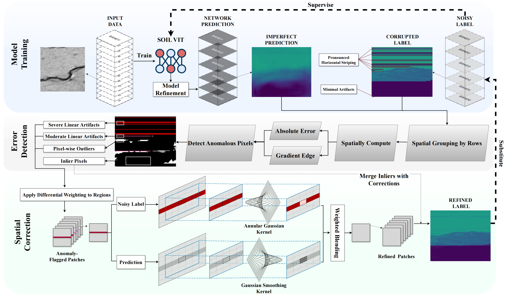

# SoilViT

Official PyTorch implementation for the paper (to be submitted): *Transforming Noisy Archives into High-Fidelity Soil Hydraulic Properties: A Structure-Aware Weakly Supervised Framework*. In this research, 

1.   A structure-aware weakly supervised framework (SoilViT) reuses noisy soil maps into high-fidelity data.
2.   Anisotropic gradient priors robustly decouple pedogenic texture from systematic interpolation artifacts.
3.   We demonstrate the framework's robust performance by generating a seamless 500-m resolution soil hydraulic dataset across China.


To resolve the supervision paradox inherent in training deep learning models on artifact-laden global datasets, as illustrated in , we propose a structure-aware Weakly-Supervised Learning (WSL) framework. Unlike standard supervised approaches that minimize reconstruction error against a static ground truth, our framework conceptualizes the reference data ($Y_{ref}$) as a noisy prior containing both the latent pedogenic signal ($Y_{true}$) and systematic structural errors ($E_{sys}$).

The framework consists of three integrated modules: (1) a Structure-Aware Label Refiner that iteratively purifies the training targets using anisotropic gradient priors; (2) a Vision Transformer backbone equipped with Hybrid Geographic Encoding to resolve spectral ambiguities across climatic zones; and (3) a Dual-Head Disentanglement mechanism that regularizes the decomposition of predictions into clean signals and spatial noise fields. This architecture creates a self-correcting loop wherein the model's increasing physical fidelity is used to progressively filter the supervision signal.

## 🚀 How to Use

### 1. Environment Setup

Please ensure you have all necessary dependencies installed. The `train.py` script uses DDP for distributed training. 

```bash
# Recommended to use a new conda or venv environment
pip install torch torchvision numpy tqdm gdal
```

# TODO: The full ReadMe will be released soon!!!

Before training, run `preprocess.py` and `data_split_loader.py` to create training/testing/validating material.
